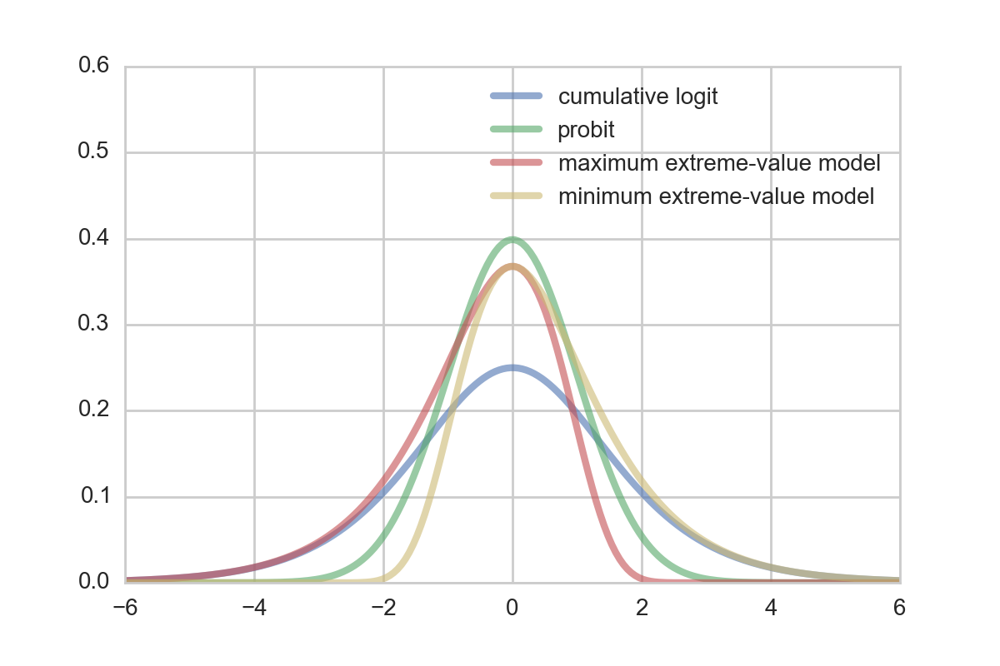
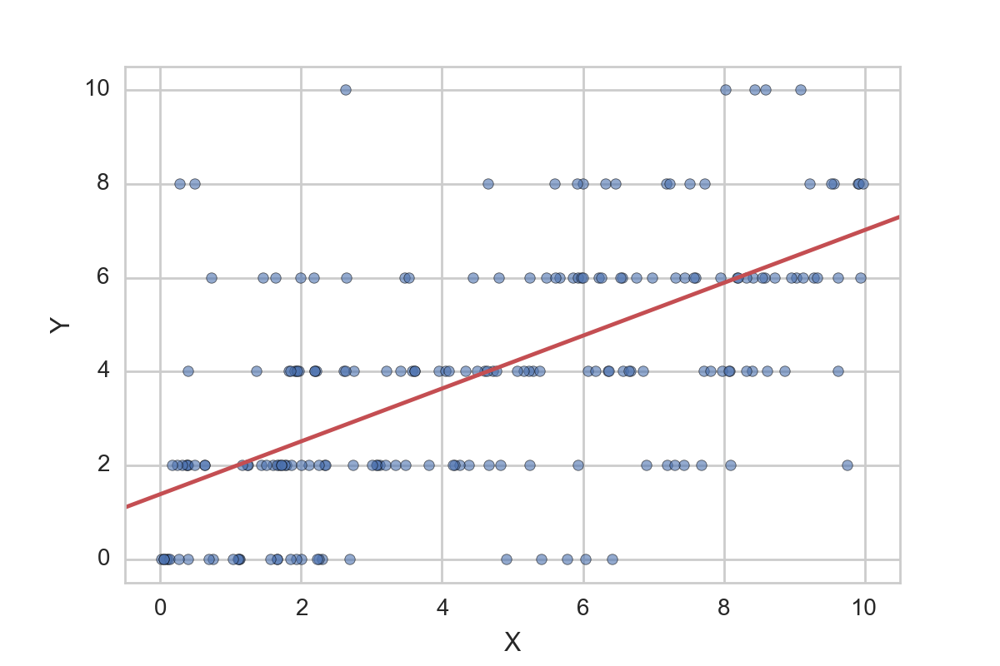
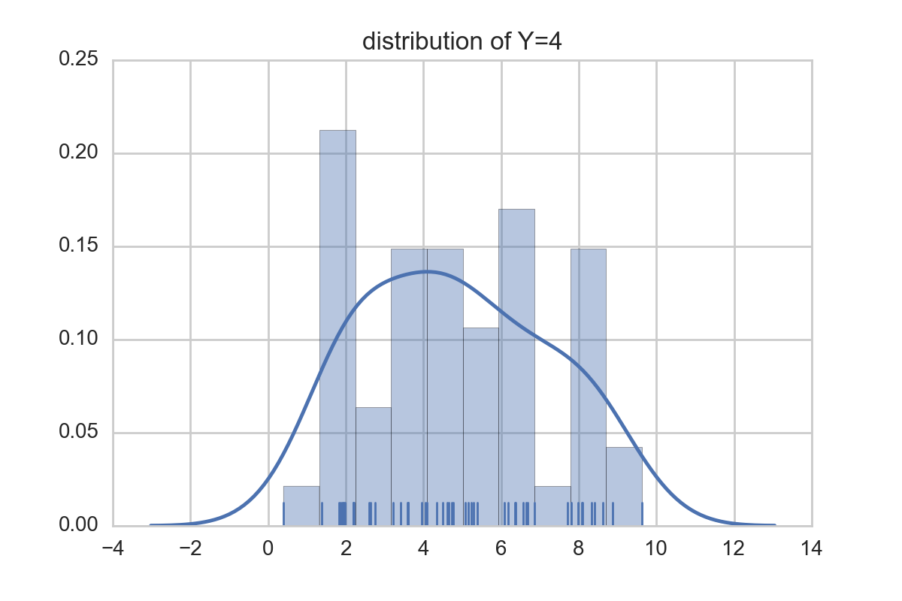

# Ordinal Regression
## Motivation
In order to model categorical data there are two possible approaches:
- multinomial logistic regression
- ordinal regression
Either of these models are an extension of the famous binary logistic regression model to allow multiple labels instead of two only.

#### Multinomial logistic regression
In Multinomial logistic regression the dependent variable $Y$ is modelled taking values in category $c = c_1, ..., c_C$  via

$$ \mathbb{P}(Y_i = c_j) = \frac{\exp(\beta_K X_i)}{1 + \sum_{k=1}^K \exp(\beta_k X_i)}$$

Both sklearn and Mlib implement this approach to some extent. I.e. sklearn can handle multinomial logistic regression, but uses a lbfgs or newton-cg approach only (no sgd) with support for L2 regularization solely. In Mlib 

However, multinomial logistic regression is not always the best model to choose. Consider i.e. the case of ratings. Here, the different categories represent ordinal values implying some kind of natural order. In a multinomial logistic regression model this order is neglected. I.e. rating '5' is as good as '4' and just another category.

Links:
- <http://scikit-learn.org/stable/modules/generated/sklearn.linear_model.LogisticRegression.html>
- <http://spark.apache.org/docs/latest/mllib-linear-methods.html>
- <http://de.slideshare.net/dbtsai/2014-0620-mlor-36132297>

#### Why Ordinal regression?
To make up for this missing order, another model that is not yet implemented in sklearn nor Mlib is ordinal regression. The following is based mainly on Chapter 9 (Tutz, G. (2012). Regression for categorical data. Cambridge: Cambridge University Press.) 

### Types of ordinal regression models
Suppose we are given a response captured by a random variable $Y \in \mathbb{R}$ which is categorial with w.l.o.g. (a mapping always exists) $K$ different categories $\lbrace 1, ..., R \rbrace $ with their natural order and furthermore
$$ \mathbb{P} ( Y \in \lbrace 1, ..., R \rbrace) = 1$$

We model the ordinal regression model using binary variables $y_1, ..., y_R$ (i.e. $y_r \sim \mathrm{Ber}(p_r) \quad \quad 0 \leq p_r \leq 1$) which will be used to transform an ordinal response variable into a binary response. This way, ordinal regression can be seen as an extension to a classical, binary variable model.

For the transformation of the ordinal response to a binary one, there are three different, commonly used approaches(let $r =1, ..., R$):

- Cumulative model:
    $$ y_r = \begin{cases}1 \quad \quad Y \in \lbrace 1, ..., r \rbrace \\ 0 \quad \quad Y \in \lbrace r+1, ..., K\rbrace\end{cases}$$
- Sequential model:
    $$ y_r\vert_{\lbrace Y \geq r \rbrace} = \begin{cases}1 \quad \quad Y =r \,\vert\, Y \geq r \\ 0 \quad \quad Y >r \,\vert\, Y \geq r \end{cases}$$
- Adjacent model:
    $$ y_r\vert_{\lbrace Y \in \lbrace r, r+1\rbrace \rbrace} = \begin{cases}1 \quad \quad Y = r \,\vert\, Y \in \lbrace r, r+1\rbrace \\ 0 \quad \quad Y = r+1 \,\vert\, Y \in \lbrace r, r+1\rbrace \end{cases}$$ 
The most versatile model of these is the cumulative assuming nothing in particular about the data except the ordinal regression assumptions. The sequential model might be used to model variables for which higher values are more likely to be reached if the lower ones have already occured. A similar argumentation holds for the adjacent model with neighbors.

### Cumulative model (Threshold model)
The cumulative model (or threshold model) can be deviated assuming a latent, underlying r.v. $\tilde{Y}$ for which the actual, observed variable $Y$ can be seen as somehow rounded.

The link between those variables shall be modelled through
$$ \lbrace Y = r \rbrace = \lbrace \theta_{r-1} < \tilde{Y} \leq \theta_r \rbrace$$
for $-\infty = \beta_0 < \beta_1 < ... < \beta_{R-1} < \beta_R = +\infty$
For the latent variable a linear regression modeladd here footnote: Sometimes this also modelled as $$ \tilde{Y} = x^Tw + \epsilon $$ leading to different signs in the cdf. However, semantically both approaches are equivalent. with $x, w \in \mathbb{R^n}$ and a random variable $\epsilon$ is choosen:

$$ \tilde{Y} = - x^Tw + \epsilon $$
It follows that
$$ \mathbb{P}(y_r = 1 \vert x, w) = \mathbb{P}(Y \leq r \vert x, w) = \mathbb{P}(-x^Tw + \epsilon \leq \beta_r) = \mathbb{P}(\epsilon \leq \beta_r + x^Tw) = F_\epsilon(\beta_r + x^Tw)$$

$$ \implies \mathbb{P}(Y = r) = F_\epsilon(\beta_r + x^Tw) - F_\epsilon(\beta_{r-1} + x^Tw)$$
using the cdf $F_\epsilon$ of $\epsilon$.

In the model setup the only thing left to define is what distribution to assume/choose for $\epsilon$. Some possible choices which yield different popular models are:

- cumulative logit model: $$ \epsilon \sim \mathrm{Logistic}(0,1)$$
- probit model: $$ \epsilon \sim \mathcal{N} (0, 1)$$
- Maximum extreme-value model: $$ \epsilon \sim \mathrm{Gumbel}(0, 1)$$
- Minimum extreme-value model: $$ -\epsilon \sim \mathrm{Gumbel}(0, 1)$$

Whereas the probit and logit model are a good choice for symmetric errors, the Gumbel and reversed Gumbel distribution can be used for the case of asymmetric error distributions to provide a better fit. For many cases, a certain assymetry regarding the error is quite natural.

#### Example

Assume we are given data that is distributed according to the plot above. As we see the data is somehow categorical distributed. Fitting a linear model (red) via OLS does not really make sense. However, thinking of a distribution of individual categories that are somehow linked together seems to be a reasonable assumption.

I.e. looking at the empirical distribution of all $X$ for the category $Y = 4$ suggests that either a reverted Gumbel or probit model might be a good idea.

#### Table of error distributions
<table>
<tr>
<td>Logistic distribution</td>
<td>$$ \mathrm{Logistic}(\mu, s)$$</td>
<td>$$ F(x) = \frac{1}{1 + \exp(-\frac{x-\mu}{s})}$$</td>
<td>$$ f(x) = \frac{\exp(-\frac{x-\mu}{s}}{s \left( 1 + \exp{- \frac{x-\mu}{s}}\right)^2}$$</td>
</tr>
<tr>
<td>Normal distribution</td>
<td>$$ \mathcal{N}(\mu, \sigma)$$</td>
<td>$$ F(x) = \Phi\left(\frac{x - \mu}{\sigma}\right)$$</td>
<td>$$ f(x) = \frac{1}{\sigma}\varphi\left(\frac{x - \mu}{\sigma}\right)$$</td>
</tr>
<tr>
<td>Gumbel distribution (Maximum extreme value)</td>
<td>$$ \mathrm{Gumbel}(\mu, \beta)$$</td>
<td>$$ F(x) = \exp \left( - \exp \left(- \frac{x - \mu}{\beta} \right) \right)$$</td>
<td>$$ f(x) = \frac{1}{\beta}\exp \left( - \left( \frac{x-\mu}{\beta} + \exp \left( \frac{x - \mu}{\beta}\right) \right) \right)$$</td>
</tr>
<tr>
<td>Flipped Gumbel distribution (Minimum extreme value)</td>
<td>$$ -\mathrm{Gumbel}(\mu, \beta)$$</td>
<td>$$ F(x) = \exp \left( - \exp \left(- \frac{-x - \mu}{\beta} \right) \right)$$</td>
<td>$$ f(x) = \frac{1}{\beta}\exp \left( - \left( \frac{-x-\mu}{\beta} + \exp \left( \frac{-x - \mu}{\beta}\right) \right) \right)$$</td>
</tr>
</table>

## Fitting the model

Assume we are given $N$ datapoints $(Y_1, X_1), ..., (Y_N, X_N)$ with $Y_i \in \lbrace 1, ..., R \rbrace, \quad X_i \in \mathbb{R}^L$ (independence assumption as usual(errors)). We simplify the fitting process, by using predefined boundaries $\beta$. Of course it is also possible to put a prior on $\beta$ and include it in the optimization approach but to do so, additional constraints need to be satisfied (i.e. $-\infty = \beta_0 < 1 < \beta_1 < 2 < ... < \beta_{R-1} < R < \beta_R = \infty$). One easy way to define the bounds is to use the middle, i.e.
$\beta_r = r - 0.5 \quad \text{for} \quad r = 1, ..., R-1$. 
Then, the log likelihood function of the data $\mathcal{D} = \lbrace (Y_1, X_1), ..., (Y_N, X_N) \rbrace$ is given as

$$ \mathcal{L}(w \; \vert \; \mathcal{D}, \beta) = \sum_{n=1}^N \log \left( F_\epsilon(\beta_{Y_n} + X_n^T w) - F_\epsilon(\beta_{Y_n-1} + X_n^Tw) \right)$$

#### Maximum Likelihood Estimate
this allows us to derive a Maximum Likelihood for the model

$$ \hat{w}_{\mathrm{MLE}} = \underset{w}{\operatorname{argmax}} \mathcal{L}(w \; \vert \; \mathcal{D}, \beta)$$
#### Maximum a posteriori estimate
The MAP estimate can be derived by ignoring the normalization constant (cf. properties of an argmax) as 
$$ \hat{w}_{\mathrm{MAP}} = \underset{w}{\operatorname{argmax}} \mathcal{L}(w \; \vert \; \mathcal{D}, \beta) + \log f_w(w)$$

with $f_w$ being the pdf of the choosen prior distribution for $w$. Popular choices are

- Ridge regression: $w \sim \mathcal{N}(0, \tau I)\quad \quad$  (Gaussian prior with diagonal matrix)
- LASSO regression: $w_i \sim \mathrm{Laplace}(0, \tau)\quad \quad$  (Laplace prior, indep. components)

## Implementation notes
One way to solve the optimization problem is using stochastic gradient descent. Of course there are other gradient descent algorithms (i.e. conjugate-gradient or l-bfgs) but for huge amounts of data these require either a small step size, a lot of memory and careful implementation. Especially in Machine Learning applications stochastic gradient descent has become one of the default algorithms and was choosen here. 

Stochastic gradient descent can be parallelized as described in the famous paper <http://www.research.rutgers.edu/~lihong/pub/Zinkevich11Parallelized.pdf>. In their paper the authors suggest a simple algorithm which distributes the data randomly over the nodes (the stoch. gradient shuffle step). Then, per node the stochastic gradient computation is performed. To optimize the process, each node should node the same amount of data and the gradient is computed over all data. Thus the 'stochasticness' is done mainly in the shuffle step. After each round computation results are aggregated by average.

Though this algorithm intuitively seems to be quite straightforward, the question was open until the paper has been released whether this approach is optimal. In the paper a proof is given that this method converges. Given that there does not exist any parallelization strategy that is able to gain more speedup the parallelized stochastic gradient implemented after the simple algorithm is optimal.

This however is a theoretical result. In our implementation we wanted to see what kind of speedup we can achieve using Spark and which model gives best accuracy at lowest computational cost.

#### Computing the gradient
One one the critical steps in any numerical optimization routine is the gradient which is the component that takes most time to evaluate. In our implementation we first used used autograd (https://github.com/HIPS/autograd) which is a handy python package for automatic differentation. Especially in the case of ordinal regression depending on which model has been choosen to present the latent variabel $\tilde{Y}$ the gradient might be not trivially deviated.

##### General Gradient
Here, an outline of computing the gradient of a simple model given $n$ datapoints is given:
$$ 
\begin{split}
\frac{\partial \mathcal{L}(w \;\vert\; \mathcal{D}, \beta )}{\partial w_j} &= \frac{\partial}{\partial w_j} \sum_{i=1}^n \log \left( F_\epsilon\left( \beta_{Y_i}  + X_i^Tw \right) - F_\epsilon\left( \beta_{Y_i - 1}  + X_i^Tw \right) \right) \\
&= \sum_{i=1}^n \frac{\partial}{\partial w_j} \log \left( F_\epsilon\left( \beta_{Y_i}  + X_i^Tw \right) - F_\epsilon\left( \beta_{Y_i - 1}  + X_i^Tw \right) \right) \\
&= \sum_{i=1}^n  \frac{\frac{\partial}{\partial w_j}\left[ F_\epsilon\left( \beta_{Y_i}  + X_i^Tw \right) - F_\epsilon\left( \beta_{Y_i - 1}  + X_i^Tw \right) \right]}{F_\epsilon\left( \beta_{Y_i}  + X_i^Tw \right) - F_\epsilon\left( \beta_{Y_i - 1}  + X_i^Tw \right)} \\
&= \sum_{i=1}^n  \frac{f_\epsilon\left( \beta_{Y_i}  + X_i^Tw \right)X_{i,j} - f_\epsilon\left( \beta_{Y_i - 1}  + X_i^Tw \right)X_{i,j}}{F_\epsilon\left( \beta_{Y_i}  + X_i^Tw \right) - F_\epsilon\left( \beta_{Y_i - 1}  + X_i^Tw \right)} \\
&= \sum_{i=1}^n  \frac{f_\epsilon\left( \beta_{Y_i}  + X_i^Tw \right) - f_\epsilon\left( \beta_{Y_i - 1}  + X_i^Tw \right)}{F_\epsilon\left( \beta_{Y_i}  + X_i^Tw \right) - F_\epsilon\left( \beta_{Y_i - 1}  + X_i^Tw \right)}X_{i,j} \\
&= \sum_{i=1}^n  g(\beta, X_i, Y_i)X_{i,j} \\
\end{split}
$$
With $X_{i,j}$ being the $j$-th component of the vector $X_i$ and $f_\epsilon$ being the density of $\epsilon$

