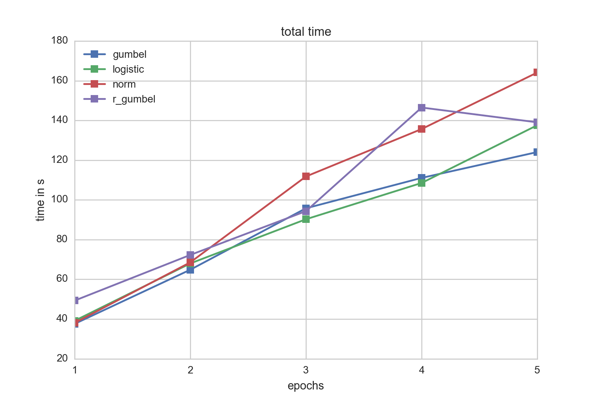
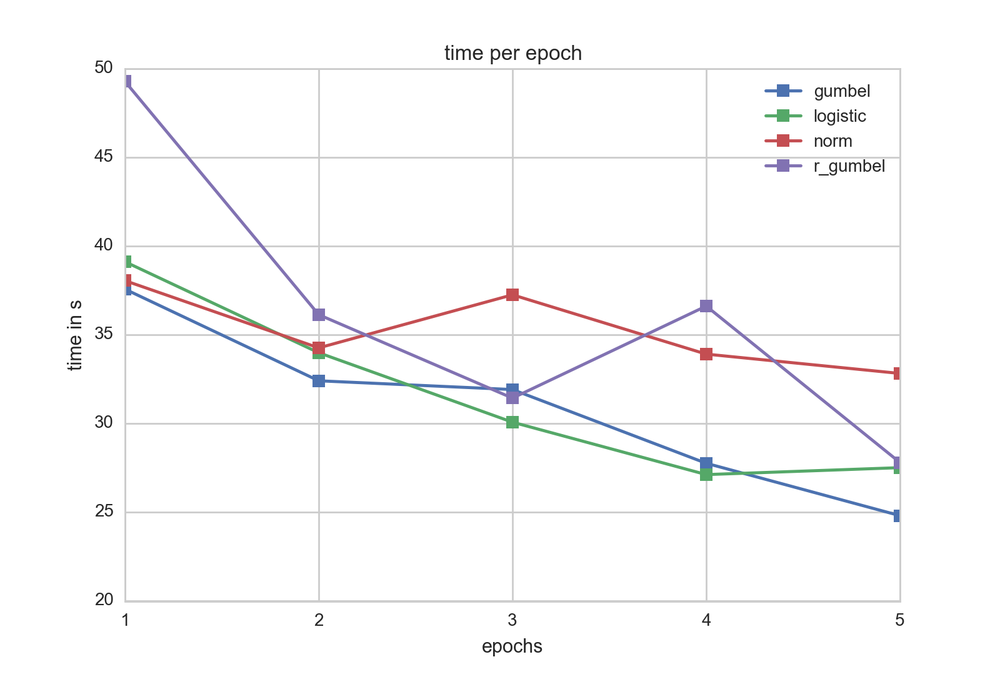
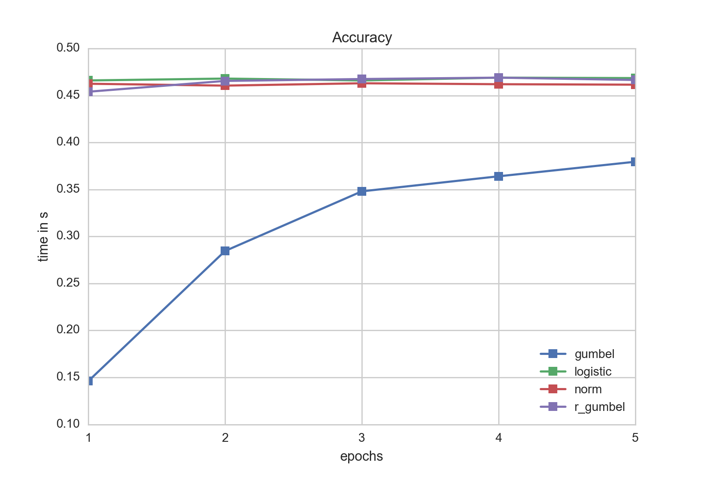

# Ordinal Regression
## Motivation
In order to model categorical data there are two possible approaches:
- multinomial logistic regression
- ordinal regression
Either of these models are an extension of the famous binary logistic regression model to allow multiple labels instead of two only.

#### Multinomial logistic regression
In Multinomial logistic regression the dependent variable $Y$ is modelled taking values in category $c = c_1, ..., c_C$  via

$$ \mathbb{P}(Y_i = c_j) = \frac{\exp(\beta_K X_i)}{1 + \sum_{k=1}^K \exp(\beta_k X_i)}$$

Both sklearn and Mlib implement this approach to some extent. I.e. sklearn can handle multinomial logistic regression, but uses a lbfgs or newton-cg approach only (no sgd) with support for L2 regularization solely. In Mlib 

However, multinomial logistic regression is not always the best model to choose. Consider i.e. the case of ratings. Here, the different categories represent ordinal values implying some kind of natural order. In a multinomial logistic regression model this order is neglected. I.e. rating '5' is as good as '4' and just another category.

Links:
- <http://scikit-learn.org/stable/modules/generated/sklearn.linear_model.LogisticRegression.html>
- <http://spark.apache.org/docs/latest/mllib-linear-methods.html>
- <http://de.slideshare.net/dbtsai/2014-0620-mlor-36132297>

#### Why Ordinal regression?
To make up for this missing order, another model that is not yet implemented in sklearn nor Mlib is ordinal regression. The following is based mainly on Chapter 9 (Tutz, G. (2012). Regression for categorical data. Cambridge: Cambridge University Press.) 

### Types of ordinal regression models
Suppose we are given a response captured by a random variable $Y \in \mathbb{R}$ which is categorial with w.l.o.g. (a mapping always exists) $K$ different categories $\lbrace 1, ..., R \rbrace $ with their natural order and furthermore
$$ \mathbb{P} ( Y \in \lbrace 1, ..., R \rbrace) = 1$$

We model the ordinal regression model using binary variables $y_1, ..., y_R$ (i.e. $y_r \sim \mathrm{Ber}(p_r) \quad \quad 0 \leq p_r \leq 1$) which will be used to transform an ordinal response variable into a binary response. This way, ordinal regression can be seen as an extension to a classical, binary variable model.

For the transformation of the ordinal response to a binary one, there are three different, commonly used approaches(let $r =1, ..., R$):

- Cumulative model:
    $$ y_r = \begin{cases}1 \quad \quad Y \in \lbrace 1, ..., r \rbrace \\ 0 \quad \quad Y \in \lbrace r+1, ..., K\rbrace\end{cases}$$
- Sequential model:
    $$ y_r\vert_{\lbrace Y \geq r \rbrace} = \begin{cases}1 \quad \quad Y =r \,\vert\, Y \geq r \\ 0 \quad \quad Y >r \,\vert\, Y \geq r \end{cases}$$
- Adjacent model:
    $$ y_r\vert_{\lbrace Y \in \lbrace r, r+1\rbrace \rbrace} = \begin{cases}1 \quad \quad Y = r \,\vert\, Y \in \lbrace r, r+1\rbrace \\ 0 \quad \quad Y = r+1 \,\vert\, Y \in \lbrace r, r+1\rbrace \end{cases}$$ 
The most versatile model of these is the cumulative assuming nothing in particular about the data except the ordinal regression assumptions. The sequential model might be used to model variables for which higher values are more likely to be reached if the lower ones have already occured. A similar argumentation holds for the adjacent model with neighbors.

### Cumulative model (Threshold model)
The cumulative model (or threshold model) can be deviated assuming a latent, underlying r.v. $\tilde{Y}$ for which the actual, observed variable $Y$ can be seen as somehow rounded.

The link between those variables shall be modelled through
$$ \lbrace Y = r \rbrace = \lbrace \theta_{r-1} < \tilde{Y} \leq \theta_r \rbrace$$
for $-\infty = \beta_0 < \beta_1 < ... < \beta_{R-1} < \beta_R = +\infty$
For the latent variable a linear regression modeladd here footnote: Sometimes this also modelled as $$ \tilde{Y} = x^Tw + \epsilon $$ leading to different signs in the cdf. However, semantically both approaches are equivalent. with $x, w \in \mathbb{R^n}$ and a random variable $\epsilon$ is choosen:

$$ \tilde{Y} = - x^Tw + \epsilon $$
It follows that
$$ \mathbb{P}(y_r = 1 \vert x, w) = \mathbb{P}(Y \leq r \vert x, w) = \mathbb{P}(-x^Tw + \epsilon \leq \beta_r) = \mathbb{P}(\epsilon \leq \beta_r + x^Tw) = F_\epsilon(\beta_r + x^Tw)$$

$$ \implies \mathbb{P}(Y = r) = F_\epsilon(\beta_r + x^Tw) - F_\epsilon(\beta_{r-1} + x^Tw)$$
using the cdf $F_\epsilon$ of $\epsilon$.

In the model setup the only thing left to define is what distribution to assume/choose for $\epsilon$. Some possible choices which yield different popular models are:

- cumulative logit model: $$ \epsilon \sim \mathrm{Logistic}(0,1)$$
- probit model: $$ \epsilon \sim \mathcal{N} (0, 1)$$
- Maximum extreme-value model: $$ \epsilon \sim \mathrm{Gumbel}(0, 1)$$
- Minimum extreme-value model: $$ -\epsilon \sim \mathrm{Gumbel}(0, 1)$$

Whereas the probit and logit model are a good choice for symmetric errors, the Gumbel and reversed Gumbel distribution can be used for the case of asymmetric error distributions to provide a better fit. For many cases, a certain assymetry regarding the error is quite natural.

#### Example

Assume we are given data that is distributed according to the plot above. As we see the data is somehow categorical distributed. Fitting a linear model (red) via OLS does not really make sense. However, thinking of a distribution of individual categories that are somehow linked together seems to be a reasonable assumption.

I.e. looking at the empirical distribution of all $X$ for the category $Y = 4$ suggests that either a reverted Gumbel or probit model might be a good idea.

#### Table of error distributions
<table>
<tr>
<td>Logistic distribution</td>
<td>$$ \mathrm{Logistic}(\mu, s)$$</td>
<td>$$ F(x) = \frac{1}{1 + \exp(-\frac{x-\mu}{s})}$$</td>
<td>$$ f(x) = \frac{\exp(-\frac{x-\mu}{s}}{s \left( 1 + \exp{- \frac{x-\mu}{s}}\right)^2}$$</td>
</tr>
<tr>
<td>Normal distribution</td>
<td>$$ \mathcal{N}(\mu, \sigma)$$</td>
<td>$$ F(x) = \Phi\left(\frac{x - \mu}{\sigma}\right)$$</td>
<td>$$ f(x) = \frac{1}{\sigma}\varphi\left(\frac{x - \mu}{\sigma}\right)$$</td>
</tr>
<tr>
<td>Gumbel distribution (Maximum extreme value)</td>
<td>$$ \mathrm{Gumbel}(\mu, \beta)$$</td>
<td>$$ F(x) = \exp \left( - \exp \left(- \frac{x - \mu}{\beta} \right) \right)$$</td>
<td>$$ f(x) = \frac{1}{\beta}\exp \left( - \left( \frac{x-\mu}{\beta} + \exp \left( \frac{x - \mu}{\beta}\right) \right) \right)$$</td>
</tr>
<tr>
<td>Flipped Gumbel distribution (Minimum extreme value)</td>
<td>$$ -\mathrm{Gumbel}(\mu, \beta)$$</td>
<td>$$ F(x) = \exp \left( - \exp \left(- \frac{-x - \mu}{\beta} \right) \right)$$</td>
<td>$$ f(x) = \frac{1}{\beta}\exp \left( - \left( \frac{-x-\mu}{\beta} + \exp \left( \frac{-x - \mu}{\beta}\right) \right) \right)$$</td>
</tr>
</table>

## Fitting the model

Assume we are given $N$ datapoints $(Y_1, X_1), ..., (Y_N, X_N)$ with $Y_i \in \lbrace 1, ..., R \rbrace, \quad X_i \in \mathbb{R}^L$ (independence assumption as usual(errors)). We simplify the fitting process, by using predefined boundaries $\beta$. Of course it is also possible to put a prior on $\beta$ and include it in the optimization approach but to do so, additional constraints need to be satisfied (i.e. $-\infty = \beta_0 < 1 < \beta_1 < 2 < ... < \beta_{R-1} < R < \beta_R = \infty$). One easy way to define the bounds is to use the middle, i.e.
$\beta_r = r - 0.5 \quad \text{for} \quad r = 1, ..., R-1$. 
Then, the log likelihood function of the data $\mathcal{D} = \lbrace (Y_1, X_1), ..., (Y_N, X_N) \rbrace$ is given as

$$ \mathcal{L}(w \; \vert \; \mathcal{D}, \beta) = \sum_{n=1}^N \log \left( F_\epsilon(\beta_{Y_n} + X_n^T w) - F_\epsilon(\beta_{Y_n-1} + X_n^Tw) \right)$$

#### Maximum Likelihood Estimate
this allows us to derive a Maximum Likelihood for the model

$$ \hat{w}_{\mathrm{MLE}} = \underset{w}{\operatorname{argmax}} \mathcal{L}(w \; \vert \; \mathcal{D}, \beta)$$
#### Maximum a posteriori estimate
The MAP estimate can be derived by ignoring the normalization constant (cf. properties of an argmax) as 
$$ \hat{w}_{\mathrm{MAP}} = \underset{w}{\operatorname{argmax}} \mathcal{L}(w \; \vert \; \mathcal{D}, \beta) + \log f_w(w)$$

with $f_w$ being the pdf of the choosen prior distribution for $w$. Popular choices are

- Ridge regression: $w \sim \mathcal{N}(0, \tau I)\quad \quad$  (Gaussian prior with diagonal matrix)
- LASSO regression: $w_i \sim \mathrm{Laplace}(0, \tau)\quad \quad$  (Laplace prior, indep. components)

## Implementation notes
One way to solve the optimization problem is using stochastic gradient descent. Of course there are other gradient descent algorithms (i.e. conjugate-gradient or l-bfgs) but for huge amounts of data these require either a small step size, a lot of memory and careful implementation. Especially in Machine Learning applications stochastic gradient descent has become one of the default algorithms and was choosen here. 

Stochastic gradient descent can be parallelized as described in the famous paper <http://www.research.rutgers.edu/~lihong/pub/Zinkevich11Parallelized.pdf>. In their paper the authors suggest a simple algorithm which distributes the data randomly over the nodes (the stoch. gradient shuffle step). Then, per node the stochastic gradient computation is performed. To optimize the process, each node should node the same amount of data and the gradient is computed over all data. Thus the 'stochasticness' is done mainly in the shuffle step. After each round computation results are aggregated by average.

Though this algorithm intuitively seems to be quite straightforward, the question was open until the paper has been released whether this approach is optimal. In the paper a proof is given that this method converges. Given that there does not exist any parallelization strategy that is able to gain more speedup the parallelized stochastic gradient implemented after the simple algorithm is optimal.

This however is a theoretical result. In our implementation we wanted to see what kind of speedup we can achieve using Spark and which model gives best accuracy at lowest computational cost.

#### Computing the gradient
One one the critical steps in any numerical optimization routine is the gradient which is the component that takes most time to evaluate. In our implementation we first used used autograd (https://github.com/HIPS/autograd) which is a handy python package for automatic differentation. Especially in the case of ordinal regression depending on which model has been choosen to present the latent variabel $\tilde{Y}$ the gradient might be not trivially deviated.

##### General Gradient
Here, an outline of computing the gradient of a simple model given $n$ datapoints is given:
$$ 
\begin{split}
\frac{\partial \mathcal{L}(w \;\vert\; \mathcal{D}, \beta )}{\partial w_j} &= \frac{\partial}{\partial w_j} \sum_{i=1}^n \log \left( F_\epsilon\left( \beta_{Y_i}  + X_i^Tw \right) - F_\epsilon\left( \beta_{Y_i - 1}  + X_i^Tw \right) \right) \\
&= \sum_{i=1}^n \frac{\partial}{\partial w_j} \log \left( F_\epsilon\left( \beta_{Y_i}  + X_i^Tw \right) - F_\epsilon\left( \beta_{Y_i - 1}  + X_i^Tw \right) \right) \\
&= \sum_{i=1}^n  \frac{\frac{\partial}{\partial w_j}\left[ F_\epsilon\left( \beta_{Y_i}  + X_i^Tw \right) - F_\epsilon\left( \beta_{Y_i - 1}  + X_i^Tw \right) \right]}{F_\epsilon\left( \beta_{Y_i}  + X_i^Tw \right) - F_\epsilon\left( \beta_{Y_i - 1}  + X_i^Tw \right)} \\
&= \sum_{i=1}^n  \frac{f_\epsilon\left( \beta_{Y_i}  + X_i^Tw \right)X_{i,j} - f_\epsilon\left( \beta_{Y_i - 1}  + X_i^Tw \right)X_{i,j}}{F_\epsilon\left( \beta_{Y_i}  + X_i^Tw \right) - F_\epsilon\left( \beta_{Y_i - 1}  + X_i^Tw \right)} \\
&= \sum_{i=1}^n  \frac{f_\epsilon\left( \beta_{Y_i}  + X_i^Tw \right) - f_\epsilon\left( \beta_{Y_i - 1}  + X_i^Tw \right)}{F_\epsilon\left( \beta_{Y_i}  + X_i^Tw \right) - F_\epsilon\left( \beta_{Y_i - 1}  + X_i^Tw \right)}X_{i,j} \\
&= \sum_{i=1}^n  g(\beta, X_i, Y_i)X_{i,j} \\
\end{split}
$$
With $X_{i,j}$ being the $j$-th component of the vector $X_i$ and $f_\epsilon$ being the density of $\epsilon$

## Analysis
As adding a prior add only a constant time factor to the model computation, for our analysis we did not focus whether the model produced actual, meaningful values (which might requires several hours - days to train for) but instead how the performance for a small subsample (2000 samples) behaved for each error type. Also, as we used more variables than data points extreme overfitting was taken into account. Thus, though not completely correct we can at some point roughly take accuracy / RMSE as some sort of measure of how fast a model adjusts.

For our testsample logistic and gumbel errors seemed to perform best in terms of fitting times. A look at the time spent per epoch underscores this

Worth to note is also that the time per epoch increases for all error distributions when the number of epochs increase. This might be due to amortization of the Spark overhead and also internal Spark caching effects.

Though in terms of speed the gumbel distribution seemed to be favorable, a quick a look at the accuracy reveals that the other models matched for the given data better. Our recommendation is therefore to use as a first start a logistic ordinal regression model. However if information about the data or its errors are known it might be a good idea to fit a Gumbel distribution as its evaluation is faster than the logistic one which might be to due to the lack of the division operator.

## A more versatile model to model ratings
In the following, a general model is developed to model ratings which are one of the areas that ordinal regression is made for. Therefore, the following variables are introduced
<table>
<tr>
<td><b>variable</b></td><td><b>meaning</b></td>
</tr>
<tr>
<td>$N$</td><td>number of data samples $n=1, ..., N$</td>
</tr>
<tr>
<td>$K$</td><td>number of latent variables per user and item</td>
</tr>
<tr>
<td>$L$</td><td>number of features describing each item</td>
</tr>
<tr>
<td>$I$</td><td>number of users, i.e. we have users $i = 1, ..., I$</td>
</tr>
<tr>
<td>$J$</td><td>number of items, i.e. $j = 1, ..., J$</td>
</tr>
<tr>
<td>$\mathcal{D}$</td><td>data matrix consisting of $N$ rows $D_n$</td>
</tr>
<tr>
<td>$\mathcal{X}$</td><td>feature data matrix consisting of $J$ rows $X_n$</td>
</tr>
<tr>
<td>$X_n$</td><td>$n$th data row, i.e $X_n = (X_{n, 1}, ..., , X_{n, L})^T$ with $X_{n,l} \in \mathbb{R}$</td>
</tr>
<tr>
<td>$D_n$</td><td>$n$th data row, i.e $D_n = (r_n, i_n, j_n)^T$ with $r_n \in \lbrace 1, ..., R\rbrace$ being a rating, $i_n, j_n$ being indices adressing a user and a item</td>
</tr>
<tr>
<td>$R$</td><td>number of ratings, i.e. each rating $r$ has to be $\in \lbrace 1, ..., R \rbrace$</td>
</tr>
<tr>
<td>$\beta$</td><td>vector describing the buckets, i.e. $-\infty = \beta_0 < 1 < \beta_1 < ... < \beta_{R-1} < R < \beta_R = \infty$</td>
</tr>
</table>
Define now the model using the ordinal regression approach with a latent variable

$$\tilde{Y}_{i, j} = - \left( u_i^Tv_j + X_j^Tw + a_i + b_j + g \right) + \epsilon$$
Let $Y_n := Y_{i_n, j_n}$

The model variables have the following definition/meaning 
<table>
<tr>
<td>$u_i \in \mathbb{R}^K$</td><td>latent variables of user $i$</td>
</tr>
<tr>
<td>$v_j \in \mathbb{R}^K$</td><td>latent variables of item $j$</td>
</tr>
<tr>
<td>$a_i \in \mathbb{R}$</td><td>bias for user $i$</td>
</tr>
<tr>
<td>$b_j \in \mathbb{R}$</td><td>bias of item $j$</td>
</tr>
<tr>
<td>$g \in \mathbb{R}$</td><td>global bias</td>
</tr>
<tr>
<td>$w \in \mathbb{R}^L$</td><td>weights for the $j$th item features</td>
</tr>
</table>

Define $\chi(i,j) := u_i^Tv_j + X_j^Tw + a_i + b_j + g$ and $\chi_n := \chi(i_n, j_n)$

The full model is parametrized via
$$\theta = \begin{pmatrix} u_1 & ... & u_I & v_1 & ... & v_J & a_1 & ... & a_I & b_1 & ... & b_J & g & w \end{pmatrix}^T$$

We can write the loglikelihood as

$$\mathcal{L}(\theta \,\vert\, \mathcal{D}, \mathcal{X}, \beta) = \sum_{n=1}^N \log \left( F_\epsilon(\beta_{Y_n} + \chi_n) - F_\epsilon(\beta_{Y_n - 1} + \chi_n) \right)$$
##### Computing the gradient
The gradient can be computed easily via the standard rules

$$
\begin{split}
\frac{\partial}{\partial u_i} \mathcal{L}(\theta \,\vert\, \mathcal{D}, \mathcal{X}, \beta) &= \sum_{n=1}^N \frac{\partial}{\partial u_i} \log \left( F_\epsilon(\beta_{Y_n} + \chi_n) - F_\epsilon(\beta_{Y_n - 1} + \chi_n) \right) \\
&= \sum_{n \in \lbrace n =1, ..., N \;\vert\; i_n = i\rbrace} \frac{\partial}{\partial u_i} \log \left( F_\epsilon(\beta_{Y_n} + \chi_n) - F_\epsilon(\beta_{Y_n - 1} + \chi_n) \right)
\end{split}
$$

Let $I_i := \lbrace n =1, ..., N \;\vert\; i_n = i\rbrace, \quad J_j := \lbrace n =1, ..., N \;\vert\; j_n = j\rbrace$ , then

$$
\begin{split}
\frac{\partial}{\partial u_i} \mathcal{L}(\theta \,\vert\, \mathcal{D}, \mathcal{X}, \beta) &= \sum_{n \in I_i}  \frac{ \frac{\partial}{\partial u_i}\left( F_\epsilon(\beta_{Y_n} + \chi_n) - F_\epsilon(\beta_{Y_n - 1} + \chi_n) \right)}{F_\epsilon(\beta_{Y_n} + \chi_n) - F_\epsilon(\beta_{Y_n - 1} + \chi_n)} \\
&= \sum_{n \in I_i}  \frac{ f_\epsilon(\beta_{Y_n} + \chi_n) - f_\epsilon(\beta_{Y_n - 1} + \chi_n)}{F_\epsilon(\beta_{Y_n} + \chi_n) - F_\epsilon(\beta_{Y_n - 1} + \chi_n)}\frac{\partial}{\partial u_i} \chi_n
\end{split}
$$

The structure will be always the same, so define
$$ q_n := \frac{ f_\epsilon(\beta_{Y_n} + \chi_n) - f_\epsilon(\beta_{Y_n - 1} + \chi_n)}{F_\epsilon(\beta_{Y_n} + \chi_n) - F_\epsilon(\beta_{Y_n - 1} + \chi_n)}$$

the gradient of any $\xi$ of the individual components can now be written as

$$ \frac{\partial}{\partial \xi} \mathcal{L}(\theta \,\vert\, \mathcal{D}, \mathcal{X}, \beta) = \sum_{n=1}^N q_n \frac{\partial}{\partial \xi}\chi_n$$
(note that for many terms this is zero!)

Given

$$ \frac{\partial}{\partial u_i}\chi_n = \begin{cases} v_{j_n} \quad n \in I_i \\
0 \quad \text{else}\end{cases}$$
$$ \frac{\partial}{\partial v_j}\chi_n = \begin{cases} u_{i_n} \quad n \in J_j \\
0 \quad \text{else}\end{cases}$$
$$ \frac{\partial}{\partial a_i}\chi_n = \begin{cases} 1 \quad n \in I_i \\
0 \quad \text{else}\end{cases}$$
$$ \frac{\partial}{\partial b_j}\chi_n = \begin{cases} 1 \quad n \in J_j \\
0 \quad \text{else}\end{cases}$$

$$ \frac{\partial}{\partial w}\chi_n = X_{j_n}$$
$$\frac{\partial}{\partial g}\chi_n = 1$$

the gradient of the full model is

$$ \frac{\partial}{\partial \theta} \mathcal{L}(\theta \,\vert\, \mathcal{D}, \mathcal{X}, \beta) = \begin{pmatrix} \sum_{n \in I_1}q_n v_{j_n} & ... & \sum_{n \in I_I}q_n v_{j_n} & \sum_{n \in J_1}q_n u_{i_n} & ... & \sum_{n \in J_J}q_n u_{i_n} & \sum_{n \in I_1}q_n & ... & \sum_{n \in I_I}q_n & \sum_{n \in J_1}q_n & ... & \sum_{n \in J_J}q_n & \sum_{n =1, ..., N}q_n & \sum_{n =1, ..., N}q_nX_{j_n} \end{pmatrix}^T$$
##### Notes
This model usually tends to have a very large parameter vector due to the latent varibales. Especially when sparse data is given (which is often the case for ratings, i.e. imagine a user who did only rank 10-20 items) in order to get a meaningful and converging model prior should be used. 
#### Links:
- <http://www.cambridge.org/de/academic/subjects/statistics-probability/statistical-theory-and-methods/regression-categorical-data>
- <http://fa.bianp.net/blog/2013/logistic-ordinal-regression/>
- <http://arxiv.org/pdf/1408.2327v6.pdf>
- <http://www.stat.ufl.edu/~aa/ordinal/agresti_ordinal_tutorial.pdf>
- <http://onlinelibrary.wiley.com/book/10.1002/9780470594001>